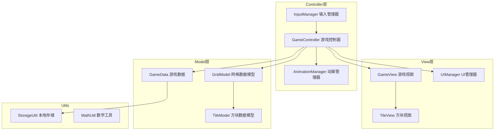

## 产品概述

基于Cocos Creator 2.4.11开发的经典2048数字合并益智游戏，采用数据层与视图分离的架构设计，代码具备良好的可维护性和扩展性。

## 核心功能

### 必完成功能

- **滑动检测**：监听触摸事件，判断上下左右滑动方向，禁止斜向滑动
- **方块移动**：滑动后所有方块向指定方向移动到最远可达位置
- **合并逻辑**：相邻相同数字方块合并，数值翻倍，每方块每次移动只能参与一次合并
- **分数系统**：当前分数实时计算，最高分通过sys.localStorage本地持久化
- **数字生成**：移动有效后在随机空白位置生成2（90%概率）或4（10%概率）
- **游戏结束判定**：网格填满且无相邻相同数字时触发游戏结束
- **重新开始**：重置游戏状态，清空网格重新初始化

### 动画效果

- 方块移动动画（100-150ms缓动）
- 合并动画（放大缩小弹跳效果）
- 新生成动画（0缩放到1，淡入效果）
- 游戏结束动画（半透明遮罩+分数面板弹出）

### 加分项功能

- 撤销功能：保存上一步状态，可撤销最近一次操作
- 多种网格：支持3x3、5x5、6x6等不同规格
- 皮肤切换：经典、糖果色、暗黑等多种配色主题

## 视觉效果

参考Screenshot_game.jpg界面设计，4x4网格布局，顶部显示分数，方块根据数值显示不同颜色，界面简洁美观。

## 技术栈选型

- **游戏引擎**：Cocos Creator 2.4.11
- **开发语言**：TypeScript
- **架构模式**：MVC分层架构（Model-View-Controller）

## 实现方案

### 架构设计

采用MVC架构实现数据层与视图层分离，模块职责清晰：



### 模块划分

| 模块 | 职责 | 文件 |
| --- | --- | --- |
| **数据模型层** | 定义数据结构，不包含任何视图逻辑 | GridModel, TileModel, GameData |
| **业务逻辑层** | 处理移动、合并、生成、判定等核心算法 | GameController |
| **视图层** | 渲染界面，处理动画表现 | GameView, TileView, UIManager |
| **输入层** | 触摸事件监听与滑动方向判断 | InputManager |
| **工具层** | 本地存储、数学计算等通用功能 | StorageUtil, MathUtil |


### 核心算法设计

**移动合并算法**（以向左移动为例）：

1. 遍历每行，从左向右收集非空方块
2. 检查相邻相同数字，执行合并（标记已合并避免重复）
3. 将合并后的数组填充到行左侧，右侧补空
4. 记录移动前后位置，用于播放动画

**游戏结束判定算法**：

1. 检查是否存在空格
2. 检查是否存在相邻相同数字（水平和垂直方向）
3. 两个条件都不满足则游戏结束

### 数据结构设计

```typescript
// 方块数据模型
interface TileData {
    id: number;           // 唯一标识
    value: number;        // 数值(2,4,8...)
    row: number;          // 行索引
    col: number;          // 列索引
    merged: boolean;      // 本轮是否已合并
}

// 网格数据模型
class GridModel {
    size: number;                    // 网格尺寸
    tiles: (TileData | null)[][];    // 二维数组存储方块
    getEmptyCells(): Cell[];         // 获取空白位置
    getTile(row: number, col: number): TileData | null;
}

// 游戏数据
class GameData {
    score: number;        // 当前分数
    bestScore: number;    // 最高分
    gridSize: number;     // 网格大小
    skin: string;         // 当前皮肤
    history: GameState[]; // 历史状态（撤销用）
}
```

### 动画实现方案

使用Cocos Creator的tween系统实现：

- **移动动画**：`cc.tween().to(0.12, {position: targetPos})`
- **合并动画**：`cc.tween().to(0.08, {scale: 1.2}).to(0.08, {scale: 1.0})`
- **新生成动画**：`cc.tween().set({scale: 0, opacity: 0}).to(0.15, {scale: 1, opacity: 255})`
- **结束动画**：遮罩淡入 + 面板弹出（scale动画）

## 目录结构

```
assets/
├── scripts/
│   ├── core/                          # 核心模块
│   │   ├── GameController.ts          # [NEW] 游戏主控制器，协调各模块，处理游戏流程
│   │   └── GameView.ts                # [NEW] 游戏视图组件，管理网格渲染和方块显示
│   ├── models/                        # 数据模型层
│   │   ├── GridModel.ts               # [NEW] 网格数据模型，管理4x4网格状态
│   │   ├── TileModel.ts               # [NEW] 方块数据模型，定义方块属性
│   │   └── GameData.ts                # [NEW] 游戏数据管理，分数/设置/历史状态
│   ├── managers/                      # 管理器模块
│   │   ├── InputManager.ts            # [NEW] 输入管理器，触摸事件和滑动检测
│   │   ├── AnimationManager.ts        # [NEW] 动画管理器，统一管理所有动画效果
│   │   └── UIManager.ts               # [NEW] UI管理器，分数显示/弹窗/按钮交互
│   ├── utils/                         # 工具模块
│   │   ├── StorageUtil.ts             # [NEW] 本地存储工具，封装sys.localStorage
│   │   ├── MathUtil.ts                # [NEW] 数学工具，随机数生成等
│   │   └── SkinConfig.ts              # [NEW] 皮肤配置，颜色主题定义
│   └── config/
│       └── GameConfig.ts              # [NEW] 游戏配置常量
├── scenes/
│   └── Main.scene                     # [NEW] 主场景文件
├── textures/
│   └── tiles/                         # [NEW] 方块纹理资源（可程序化生成）
└── audio/
    └── *.mp3                          # [NEW] 音效资源（可选）
```

## 实现注意事项

- **性能优化**：对象池复用Tile节点，避免频繁创建销毁；动画使用cc.tween而非update
- **数据流**：用户输入 → InputManager检测 → GameController处理 → GridModel更新 → GameView渲染
- **状态管理**：每次移动前保存当前状态快照用于撤销功能
- **皮肤系统**：使用配置表定义不同主题颜色，运行时动态切换

## 设计风格

采用现代简约风格，借鉴Material Design设计理念，界面清晰易读，色彩鲜明但不刺眼。方块采用圆角矩形设计，根据数值递增显示渐变色阶。

## 界面布局

### 主界面结构（从上到下）

1. **顶部栏**：游戏标题"2048"居中，左侧当前分数，右侧最高分
2. **功能按钮区**：撤销按钮、重新开始按钮、设置按钮（皮肤切换/网格大小）
3. **游戏区域**：4x4网格，圆角背景，方块带阴影效果
4. **底部信息**：操作提示"滑动方块，合并相同数字"

### 方块颜色系统

根据数值定义不同背景色，数值越大颜色越深/暖：

- 2: 浅灰 #eee4da
- 4: 米色 #ede0c8
- 8: 橙色 #f2b179
- 16: 深橙 #f59563
- 32: 红橙 #f67c5f
- 64: 红色 #f65e3b
- 128: 金黄 #edcf72
- 256: 深金 #edcc61
- 512: 亮金 #edc850
- 1024: 黄色 #edc53f
- 2048: 金色 #edc22e

### 动效设计

- 方块移动：平滑过渡，带有轻微的加速效果
- 合并：弹性缩放动画，产生弹跳感
- 新生成：从中心放大淡入，营造"出现"感
- 游戏结束：遮罩渐显 + 结果面板从中间弹出