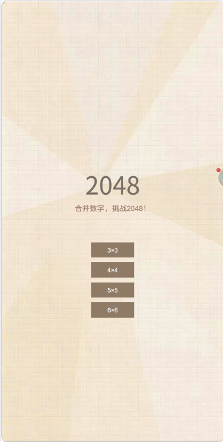
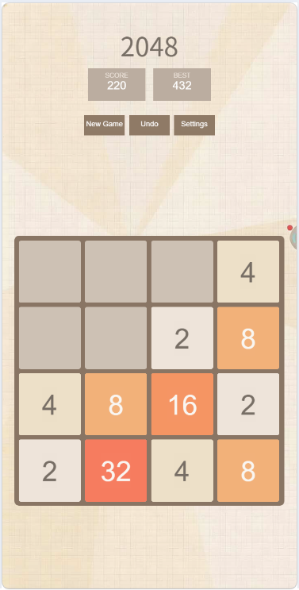
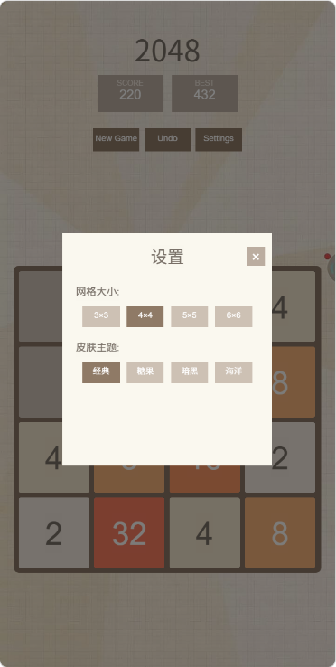
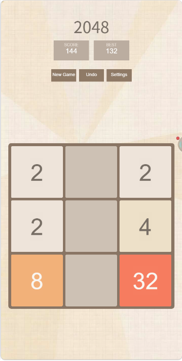
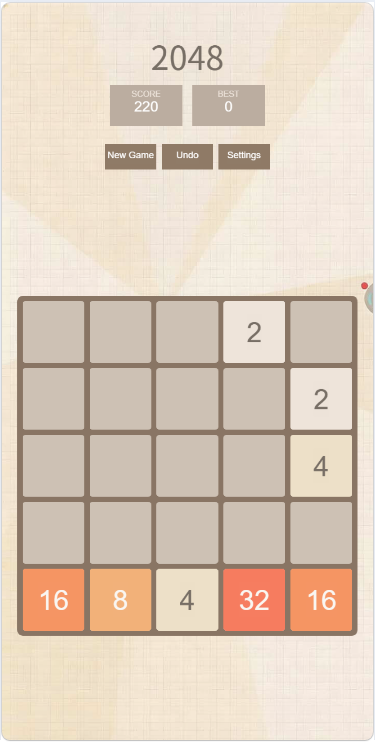
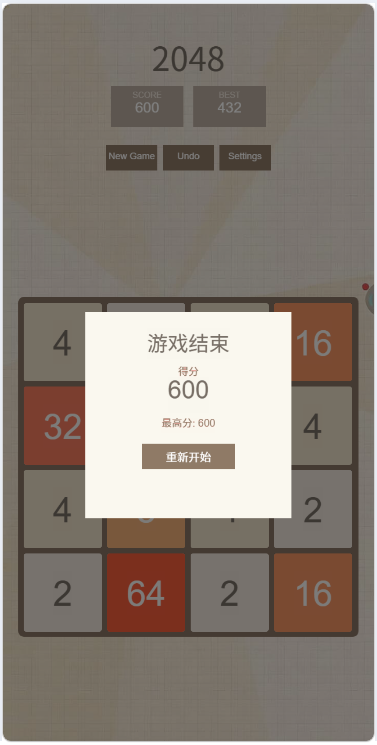
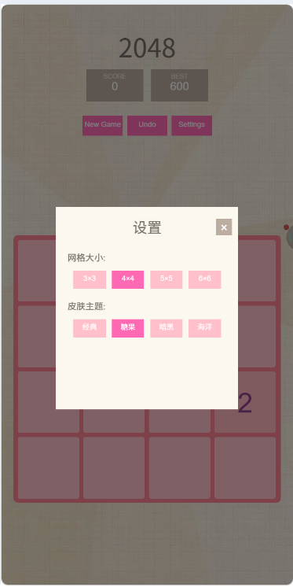
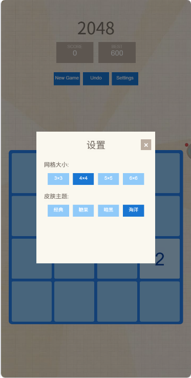
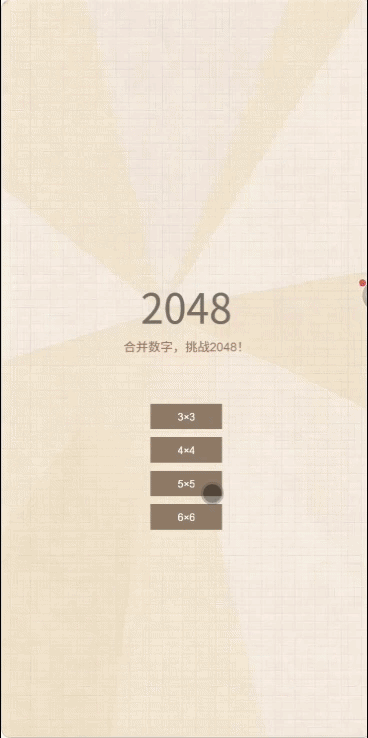

# 2048 游戏

## 游戏截图










## 游戏演示



基于 Cocos Creator 2.4.11 开发的经典 2048 数字合并益智游戏。

## 游戏简介

经典 2048 益智游戏，玩家通过上下左右滑动，使相同数字的方块合并，目标是合成 2048 这个数字。游戏规则简单，但需要合理的策略才能获得高分。

## 开发环境

- **游戏引擎**: Cocos Creator 2.4.11
- **开发语言**: TypeScript
- **目标平台**: Web / iOS / Android

## 运行步骤

1. 下载并安装 [Cocos Creator 2.4.11](https://www.cocos.com/creator-download)
2. 打开 Cocos Creator，选择「打开其他项目」
3. 选择本项目根目录（`2048` 文件夹）
4. 等待项目加载完成
5. 打开 `assets/scenes/Main.fire` 场景
6. 点击编辑器顶部的「播放」按钮运行游戏

## 项目结构

```
2048/
├── assets/
│   ├── scripts/
│   │   ├── config/              # 配置模块
│   │   │   ├── GameConfig.ts    # 游戏配置常量
│   │   │   ├── PanelConfig.ts   # 面板配置
│   │   │   └── MessageEvents.ts # 消息事件定义
│   │   ├── core/                # 核心模块
│   │   │   ├── GameController.ts # 游戏主控制器
│   │   │   ├── GameView.ts      # 游戏视图组件
│   │   │   └── TileView.ts      # 方块视图组件
│   │   ├── managers/            # 管理器模块
│   │   │   ├── InputManager.ts  # 输入管理器
│   │   │   ├── AnimationManager.ts # 动画管理器
│   │   │   ├── PanelManager.ts  # 面板管理器
│   │   │   └── MessageManager.ts # 消息管理器
│   │   ├── models/              # 数据模型层
│   │   │   ├── TileModel.ts     # 方块数据模型
│   │   │   ├── GridModel.ts     # 网格数据模型
│   │   │   └── GameData.ts      # 游戏数据管理
│   │   ├── panels/              # 面板模块
│   │   │   ├── BasePanel.ts     # 面板基类
│   │   │   ├── StartPanel.ts    # 开始面板
│   │   │   ├── MainPanel.ts     # 主界面面板
│   │   │   ├── SettingsPanel.ts # 设置面板
│   │   │   └── GameOverPanel.ts # 游戏结束面板
│   │   ├── utils/               # 工具模块
│   │   │   ├── StorageUtil.ts   # 本地存储工具
│   │   │   ├── MathUtil.ts      # 数学工具
│   │   │   ├── SkinConfig.ts    # 皮肤配置
│   │   │   └── UIUtils.ts       # UI工具函数
│   │   ├── MainScene.ts         # 主场景脚本
│   │   └── SceneSetup.ts        # 场景初始化
│   ├── scenes/                  # 场景文件
│   │   └── Main.fire            # 主场景
│   └── textures/                # 图片资源
├── screenshots/                 # 游戏截图和演示
│   ├── game_1.png               # 游戏截图
│   └── game-gif.gif             # 游戏演示
├── library/                     # 引擎缓存（自动生成）
├── local/                       # 本地配置
├── packages/                    # 扩展包
├── settings/                    # 项目设置
├── project.json                 # 项目配置
└── tsconfig.json               # TypeScript配置
```

## 已实现功能

### 必做功能 ✅

- [x] **滑动检测** - 监听触摸事件，判断滑动方向（上下左右），禁止斜向滑动
- [x] **方块移动** - 滑动后所有方块向指定方向移动到最远可到达位置
- [x] **合并逻辑** - 同一次移动中，每个方块只能参与一次合并；合并后得分增加
- [x] **分数计算** - 合并方块的数值累加到总分；显示当前分数和最高分
- [x] **新数字生成** - 移动有效后，在随机空白位置生成 2（90%）或 4（10%）
- [x] **游戏结束判定** - 所有方块填满且没有相邻相同数字时，游戏结束
- [x] **本地存储** - 使用 sys.localStorage 保存最高分，下次打开自动读取
- [x] **重新开始** - 提供重新开始按钮，重置游戏状态

### 动画效果 ✅

- [x] **方块移动动画** - 方块从原位置缓动移动到目标位置，时长 120ms
- [x] **合并动画** - 合并时方块放大再缩小，形成弹跳效果
- [x] **新生成动画** - 新方块从 0 缩放到 1，淡入效果
- [x] **游戏结束动画** - 游戏结束时，半透明遮罩 + 分数面板弹出

### 加分项 ✅

- [x] **撤销功能** - 保存上一步状态，可撤销最近一次操作
- [x] **多种网格** - 支持 3×3、4×4、5×5、6×6 等不同规格
- [x] **皮肤切换** - 提供经典、糖果色、暗黑、海洋等多种配色主题

## 游戏玩法

1. **滑动操作**：在游戏区域上下左右滑动
2. **合并规则**：相同数字的方块碰撞时会合并，数值翻倍
3. **目标**：合成 2048 方块即可获胜，可继续挑战更高分数
4. **游戏结束**：当网格填满且无法移动时，游戏结束

## 操作说明

- **滑动**：在游戏区域滑动控制方块移动
- **撤销按钮**：撤销上一步操作
- **重新开始按钮**：重置游戏
- **设置按钮**：调整网格大小和皮肤主题

## 架构设计

本项目采用 **MVC 架构**，实现数据层与视图层分离：

```
┌────────────────────────────────────────────────────────────┐
│                        View 层                              │
│  ┌──────────────┐   ┌──────────────┐   ┌──────────────┐   │
│  │   GameView   │   │   TileView   │   │    Panels    │   │
│  │  游戏主视图   │   │  方块视图     │   │   UI面板      │   │
│  └──────────────┘   └──────────────┘   └──────────────┘   │
└───────────────────────────┬────────────────────────────────┘
                            │
┌───────────────────────────┼────────────────────────────────┐
│                    Controller 层                            │
│  ┌────────────────────────┴───────────────────────────┐    │
│  │                GameController                        │    │
│  │            游戏主控制器（协调各模块）                  │    │
│  └───────────────────────────┬────────────────────────┘    │
│                              │                              │
│  ┌───────────────────────────┼────────────────────────┐    │
│  │  ┌──────────────────┐     │  ┌──────────────────┐  │    │
│  │  │  InputManager    │     │  │  PanelManager    │  │    │
│  │  │   输入管理器      │     │  │   面板管理器      │  │    │
│  │  └──────────────────┘     │  └──────────────────┘  │    │
│  │  ┌──────────────────┐     │  ┌──────────────────┐  │    │
│  │  │ AnimationManager │     │  │ MessageManager   │  │    │
│  │  │   动画管理器      │     │  │   消息管理器      │  │    │
│  │  └──────────────────┘     │  └──────────────────┘  │    │
│  └─────────────────────────────────────────────────────┘    │
└───────────────────────────┬────────────────────────────────┘
                            │
┌───────────────────────────┼────────────────────────────────┐
│                        Model 层                             │
│  ┌─────────────────────────────────────────────────────┐   │
│  │                    GridModel                         │   │
│  │              网格数据模型（4×4数组）                    │   │
│  └───────────────────────────┬─────────────────────────┘   │
│                              │                              │
│  ┌───────────────────────────┼─────────────────────────┐   │
│  │                     TileModel                        │   │
│  │                方块数据模型                           │   │
│  └─────────────────────────────────────────────────────┘   │
│  ┌─────────────────────────────────────────────────────┐   │
│  │                     GameData                         │   │
│  │           游戏数据（分数、设置、历史状态）              │   │
│  └─────────────────────────────────────────────────────┘   │
└────────────────────────────────────────────────────────────┘
```

详细设计请参考 [DESIGN.md](DESIGN.md)

## 遇到的问题和解决方案

### 1. 方块合并逻辑
**问题**：如何确保每次移动中每个方块只参与一次合并？

**解决**：使用 `merged` 标记位，合并后设置标记，本轮不再参与合并。

### 2. 动画同步
**问题**：多个方块同时移动，动画如何同步完成？

**解决**：使用计数器记录动画数量，每个动画完成时递减，归零时触发回调。

### 3. 皮肤切换
**问题**：如何动态切换主题颜色？

**解决**：使用 `SkinConfig` 配置类存储主题数据，切换时刷新所有节点颜色。

## 许可证

MIT License
